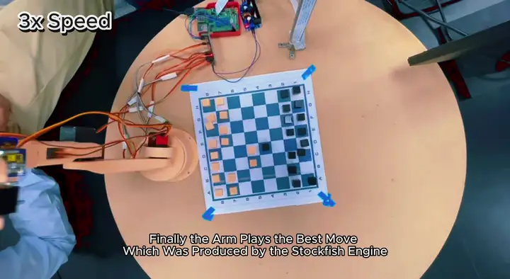
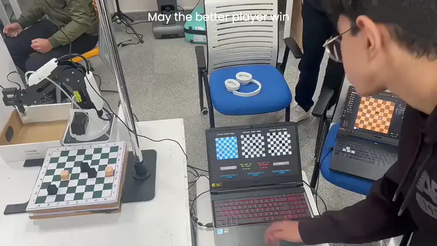

# Magnus & Hikaru: Two Generations of a Chess-Playing Robot Arm

Two university robotics projects, nine months apart, built by an overlapping
team on completely different hardware. Both answer the same question: can a robot
arm watch you play a move and reply with one of its own?

<p align="center">
  
  
</p>

<p align="center"><em>Left: Magnus Armsen (v1), 3D-printed, 6 DOF. Right: Hikaru Nakarmsen (v2), Dobot Magician, 4 DOF.</em></p>

Both are named after chess world number ones, Magnus **Carlsen** and Hikaru
**Nakamura**, with an arm pun welded on.

---

## The two generations

|               | **Magnus Armsen (v1)**          | **Hikaru Nakarmsen (v2)**                |
| ------------- | ------------------------------- | ---------------------------------------- |
| Course        | GN312, Embedded Systems & IoT   | RB310, Fundamentals of Robotics          |
| Date          | March 2023                      | November 2023                            |
| Arm           | 3D-printed, 6 DOF, hobby servos | Dobot Magician, 4 DOF                    |
| End effector  | Printed gripper                 | Vacuum suction cup                       |
| Controller    | Raspberry Pi 4B 8 GB            | Desktop PC over USB                      |
| Camera        | Raspberry Pi HQ Camera          | Logitech C270                            |
| Interface     | Flask web app                   | Tkinter desktop app                      |
| Engine        | Stockfish                       | Stockfish + a vendored AlphaZero (DRLCE) |
| Repeatability | Uncalibrated                    | ±0.2 mm                                  |
| Budget        | 9,000 EGP                       | 1,000 EGP                                |

Both robots work the same way: photograph the board, photograph it again after
your move, diff the 64 squares, infer what you played, ask a chess engine for a
reply, and move a piece.

---

## Magnus Armsen, v1

<p align="center">
  
</p>

The arm itself was the project. Ten 3D-printed parts, six servos across three
types, a PCA9685 PWM driver, and a Raspberry Pi, all running open-loop with
nothing measuring whether a joint actually arrived where it was told.

The interface is a Flask web app: a split black-and-white card design,
chessboard.js for the board, live status, difficulty selection, and a chat
easter egg. The browser and the Python backend talk through a hand-designed
protocol of interchange variables and numeric error codes, written up in
[`magnus-v1/docs/protocol-notes.txt`](magnus-v1/docs/protocol-notes.txt).

<p align="center">
  
  
  
</p>

**→ [`magnus-v1/`](magnus-v1/)** · [full demo video](../../releases) · 9,000 EGP · reproducible if you have a printer

---

## Hikaru Nakarmsen, v2

<p align="center">
  
</p>

The second generation bought the arm and spent the effort elsewhere. A Dobot
Magician brings ±0.2 mm repeatability and inverse kinematics in firmware, so the
work moved up the stack: a camera-to-arm coordinate transform, a much stronger
vision module, and a second chess engine integrated alongside Stockfish.

The interface became a Tkinter desktop app. No browser, no protocol layer, the
UI and robot logic in one process.

<p align="center">
  
  
  
</p>

The play screen shows all three views at once: the virtual board, plus the
previous and current camera frames it diffs to work out your move.

**→ [`hikaru-v2/`](hikaru-v2/)** · [full demo video](../../releases) · 1,000 EGP · needs a Dobot Magician

---

## What changed between them

The most interesting thing here is not either robot. It is the **delta**.

- **The arm stopped being the project.** v1's central risk was "controlling the
  robotic arm, a problem never addressed before by any group member". v2 bought
  that problem off the shelf for a ninth of the budget.
- **Suction beat grasping, by changing the world.** Rather than making the
  gripper cleverer, v2 3D-printed flat-topped chess pieces sized for a 2 cm
  suction cup and raised the board 4.5 cm. A dumb manipulator became sufficient.
- **The protocol layer vanished.** Moving from web app to desktop app deleted an
  entire hand-written browser↔Python contract.
- **Vision grew a coordinate system.** v1's `C2M` only answered _"what moved?"_.
  v2's also answers _"where is that square in the arm's frame?"_, because v2
  commands Cartesian positions instead of joint angles.

Full write-up: **[docs/02-evolution.md](docs/02-evolution.md)**

---

## Documentation

|                                                |                                          |
| ---------------------------------------------- | ---------------------------------------- |
| [01. Overview](docs/01-overview.md)            | What both projects are, at a glance      |
| [02. Evolution](docs/02-evolution.md)          | v1 → v2: what changed and why            |
| [03. Vision (C2M)](docs/03-vision-c2m.md)      | Board detection and move inference       |
| [04. Chess engines](docs/04-chess-engines.md)  | Stockfish, and the vendored AlphaZero    |
| [05. Kinematics](docs/05-kinematics.md)        | DH model and the camera→arm transform    |
| [06. Hardware](docs/06-hardware.md)            | Both bills of materials, servos vs Dobot |
| [07. Running the code](docs/07-running.md)     | Setup on Linux, macOS and Windows        |

---

## Repository map

```
├── docs/            the write-ups above
├── media/           stills and clips from the demo footage
├── magnus-v1/       Raspberry Pi + servos + Flask
│   ├── src/           the integrated app
│   ├── web/           templates and static assets
│   ├── prototypes/    per-subsystem code, before integration
│   ├── hardware/      STLs, schematics, bill of materials
│   └── docs/          proposal, documentation, protocol notes
├── hikaru-v2/       Dobot Magician + Tkinter + DRLCE
│   ├── Dobot/         vendor SDK wrapper
│   ├── DRLCE/         AlphaZero network and MCTS
│   ├── hardware/      chess piece STL, RoboDK station
│   ├── testing/       test scripts and captured board images
│   └── docs/          proposal, documentation, TODO list
└── tools/           fetch scripts for large release assets
```

---

## Quick start

Both projects run on Linux, macOS and Windows. Neither arm can be driven without
its hardware, but **the vision, engines and both interfaces run on a laptop**.

Each project keeps its own virtual environment, so you can set up one without
the other.

### Before you start

**Python 3.11 is required.** `torch==2.1.2` publishes no wheels for anything
newer, and both projects pin dependency versions from 2023.

For Hikaru, that 3.11 build must also include Tkinter, which many do not.
Check before you go further:

```bash
python3.11 -c "import tkinter; print(tkinter.TkVersion)"
```

If that raises `ModuleNotFoundError: No module named '_tkinter'`, your
interpreter was built without Tk. Whether a build has it depends on how it was
compiled: pyenv skips Tk unless the Tk headers were installed beforehand, so a
pyenv 3.11 built on a bare machine will not have it. Install Tk
(`pacman -S tk`, `apt install python3-tk`, `brew install python-tk`), rebuild
that version, and check again. More detail in
[docs/07-running.md](docs/07-running.md).

### Install Stockfish first

Neither project vendors the engine. Install it once:

```bash
sudo pacman -S stockfish      # Arch
sudo apt install stockfish    # Debian/Ubuntu
brew install stockfish        # macOS
winget install Stockfish.Stockfish   # Windows
```

Any recent release works. If you would rather not install it system-wide,
download a binary and either set `STOCKFISH_PATH` to it or drop it at
`magnus-v1/engine/stockfish` or `hikaru-v2/engine/stockfish`, where both
projects look automatically.

### Get the code

```bash
git clone https://github.com/Momad-Y/Magnus-Hikaru-Chess-Robots.git
cd Magnus-Hikaru-Chess-Robots
```

### Magnus (v1), the web app

From the repository root:

```bash
cd magnus-v1
python3.11 -m venv .venv
source .venv/bin/activate          # Windows: .venv\Scripts\activate
pip install -r requirements.txt
python src/app.py
```

Open <http://127.0.0.1:9999>. All three pages work without a camera or an arm.

### Hikaru (v2), the desktop app

From the repository root again (`cd ..` first if you just set up Magnus):

```bash
cd hikaru-v2
python3.11 -m venv .venv
source .venv/bin/activate          # Windows: .venv\Scripts\activate
pip install -r requirements.txt
python ../tools/fetch_weights.py   # 93 MB DRLCE network, not stored in git
python main.py
```

Open **Settings** and set the camera ID if the default of 0 is wrong.
Difficulty 1 to 4 is Stockfish; difficulty 5 switches to DRLCE.

> Installing `torch==2.1.2` pulls roughly 2.5 GB of CUDA libraries. If you have
> no NVIDIA GPU, or want a much smaller install, use the CPU build instead:
> `pip install torch==2.1.2 --index-url https://download.pytorch.org/whl/cpu`.
> DRLCE actually runs faster on CPU at the default 10 rollouts per move.

---

## Team

**Magnus Armsen (v1)**: Hazem Abdelghafar · Mohamed Abdelnasser ·
**Belal Sameh** · Mohamed Elfeel

**Hikaru Nakarmsen (v2)**: Hazem Abdelghafar · Mohamed Abdelnasser ·
Mohamed Elfeel

Both projects were supervised by Dr. Omar Shalash and Eng. Hossam Eldeen.

Arab Academy for Science, Technology & Maritime Transport (AAST).

## Licence and attribution

Project code is Apache-2.0, see [LICENSE](LICENSE). Third-party components keep
their own licences, listed in [NOTICE](NOTICE).

**DRLCE**, the neural chess engine at difficulty 5, is adapted from
[jackdawkins11/pytorch-alpha-zero](https://github.com/jackdawkins11/pytorch-alpha-zero),
with credit to its author. Only the wrapper around it was written here. See
[`hikaru-v2/DRLCE/ATTRIBUTION.md`](hikaru-v2/DRLCE/ATTRIBUTION.md).
