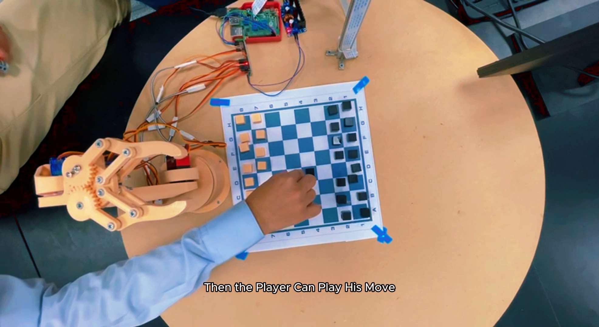
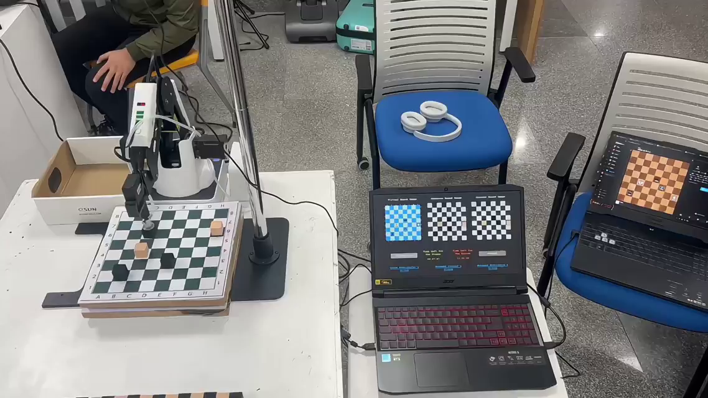

# Hardware

Two robots, two philosophies. v1 built its arm; v2 bought one.

---

## Magnus (v1) — built from scratch

A six-degree-of-freedom arm, 3D-printed in ten parts, driven by hobby servos
from a Raspberry Pi.

### Bill of materials

From the March 2023 project proposal. Total **9,000 EGP**.

| Component | Qty | Price (EGP) |
|---|---:|---:|
| Raspberry Pi 4 Model B+ | 1 | 5,600 |
| Pi camera board | 1 | 850 |
| 3D printer filament, 1 kg | 1 | 530 |
| MG996r servo | 3 | 555 |
| SG90 servo | 3 | 240 |
| Arm gripper | 1 | 150 |
| SanDisk 64 GB SD card | 1 | 150 |
| Pi 4 adapter with on/off switch | 1 | 120 |
| Pi CSI camera holder | 1 | 65 |
| Camera ribbon cable, 100 cm | 1 | 55 |
| Pi heat-sink kit | 1 | 30 |
| HDMI female → mini HDMI adapter | 1 | 15 |
| Speaker | 1 | 20 |
| Microphone | 1 | 20 |
| Jumpers, bolts, nuts, screws, board, domain | — | 600 |

The as-built documentation lists a **Raspberry Pi HQ Camera** and adds a
**CYS-S0200** servo, so the final build diverged from the proposal's parts list.
The speaker and microphone were bought for the voice-control feature that was
never implemented.

### Printed parts

Ten STL files in [`../magnus-v1/hardware/stl/`](../magnus-v1/hardware/stl/):

| Part | Qty |
|---|---:|
| Base | 1 |
| Waist | 1 |
| Arm 01 / 02 / 03 | 1 each |
| Gear 01 / 02 | 1 each |
| Gripper base | 1 |
| Gripper 01 | 2 |
| Grip Link 01 | 4 |

Plus `Full Arm Model w Servos.stl`, the complete assembly including servo
bodies — the one to open first if you want to understand how it fits together.

### Electronics

Six servos exceed the Pi's PWM capability, so a **PCA9685** 16-channel 12-bit PWM
driver sits between them, addressed over I²C at `0x40`. Pulse widths of 150–650
counts map to 0–180°.

Wiring is in [`../magnus-v1/hardware/schematics/`](../magnus-v1/hardware/schematics/)
as both a Fritzing source file (`.fzz`) and a rendered JPG.

### Why it is hard to reproduce

Nothing measures whether a joint reached its commanded angle. Accuracy comes from
per-servo `ZeroOffset` calibration constants tuned by hand, which are specific to
one physical build. Reprinting the parts will not reproduce the offsets.

---

## Hikaru (v2) — Dobot Magician

### Specifications

| | |
|---|---|
| Degrees of freedom | 4 |
| Payload | 500 g |
| Max reach | 320 mm |
| Repeatability | ±0.2 mm |
| Net weight | 3.4 kg |
| Power | 100–240 V, 78 W max |
| End effector | Vacuum suction cup |
| Interface | USB (also Wi-Fi / Bluetooth) |

Total project cost: **1,000 EGP** — roughly a ninth of v1, because the arm
already existed.

### Camera

A **Logitech C270** webcam on a stand above the board: 720p, 30 fps, 0.9 MP,
55° diagonal field of view.

### The board and pieces

Suction dictated the physical design. Pieces were 3D-printed with flat tops
sized for a 2 cm cup, 2.25–2.5 cm across, and the board was raised 4.5–5 cm to
sit inside the arm's envelope. Candidate board sizes worked out in `TODOs.docx`
were 29×29, 28×28 and 27×27 cm.

The piece model is at
[`../hikaru-v2/hardware/chess-piece.stl`](../hikaru-v2/hardware/chess-piece.stl),
and a RoboDK simulation station at
[`../hikaru-v2/hardware/robodk-station.rdk`](../hikaru-v2/hardware/robodk-station.rdk).

### Vendor documentation

Dobot's manuals are not redistributed here — they are third-party copyrighted
material and roughly 50 MB. Get them from the source:

- [Dobot Magician product page](https://www.dobot-robots.com/products/education/magician.html)
- [Dobot download portal](https://download.dobot.cc/) — user guides, communication
  protocol, API description, SDKs, 3D models and dimension drawings

The SDK matters for anyone outside Windows: this repository ships only the
Windows `DobotDll.dll`. Linux and macOS need `libDobotDll.so` / `.dylib` from
Dobot's own SDK downloads. See [07-running.md](07-running.md).

---

## Comparison

| | Magnus (v1) | Hikaru (v2) |
|---|---|---|
| Cost | 9,000 EGP | 1,000 EGP |
| DOF | 6 | 4 |
| Reproducible? | Yes — print and wire it | No — buy the arm |
| Repeatability | Unspecified, uncalibrated | ±0.2 mm |
| Compute | Raspberry Pi 4B 8 GB | Desktop PC |
| Camera | Pi HQ Camera | Logitech C270 |
| End effector | Printed gripper | Vacuum suction cup |
| Feedback | None | Vendor firmware closed loop |

The trade is stark. v1 is fully reproducible and unreliable. v2 is reliable and
not reproducible at all without buying the same arm.
