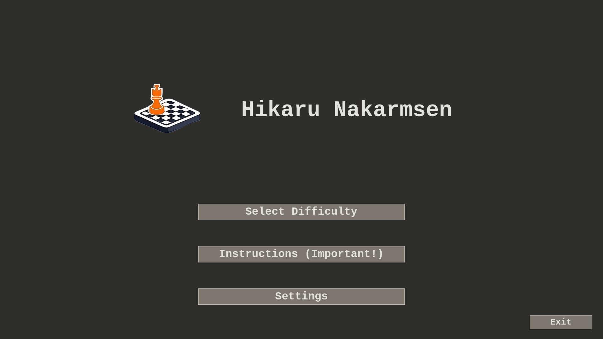
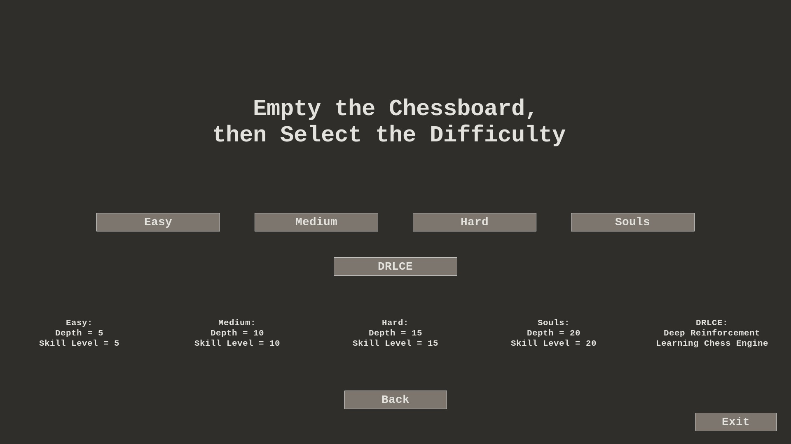
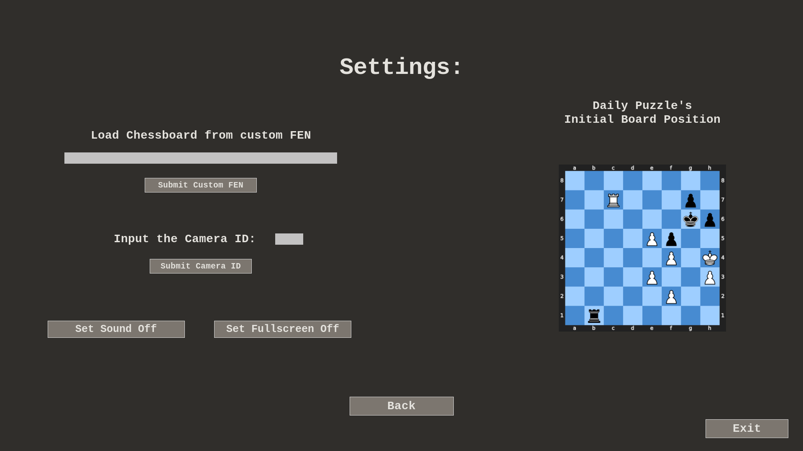
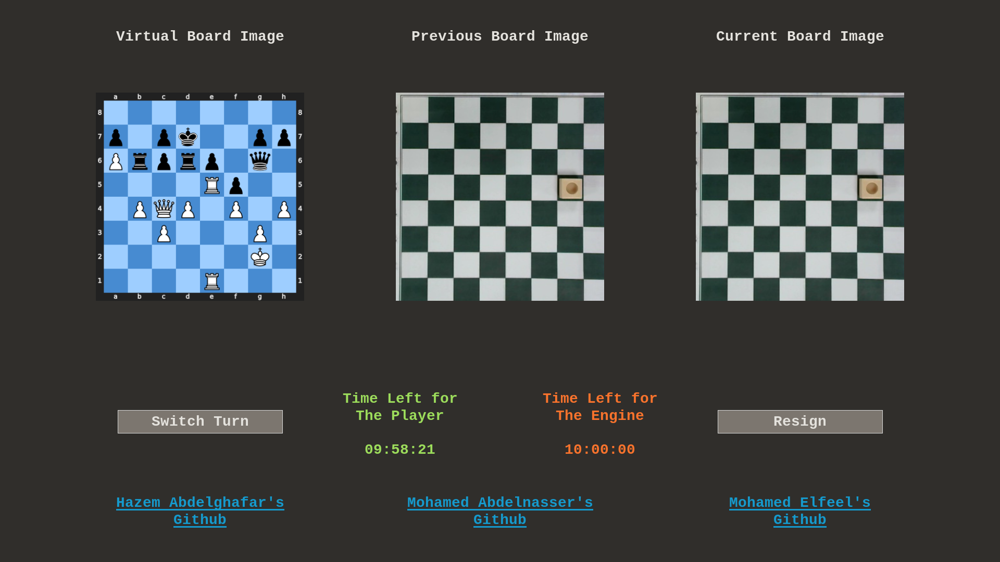

# Hikaru Nakarmsen — v2

A Dobot Magician automated to play chess against a human: a webcam reads the
board, a chess engine picks the reply, and the arm plays it with a suction cup.

Built November–December 2023 for **RB310 — Fundamentals of Robotics** at AAST by
Hazem Abdelghafar, Mohamed Abdelnasser and Mohamed Elfeel. Budget: 1,000 EGP.

<p align="center">
  
</p>

## What changed from [v1](../magnus-v1/)

The arm stopped being the project. A Dobot Magician brings ±0.2 mm repeatability
and inverse kinematics in firmware, so the effort moved up the stack: a
camera-to-arm coordinate transform, a substantially stronger vision module, and
a second chess engine integrated alongside Stockfish.

Full comparison: [docs/02-evolution.md](../docs/02-evolution.md)

## Layout

```
main.py          entry point — builds the Tk root and the game
GUI.py           the whole desktop interface (~1,200 lines)
C2M.py           Chess board to Moves — vision + camera→arm coordinates
CE.py            chess engine layer: Stockfish and DRLCE
DrDRA.py         translates a move into arm motion
engine_path.py   cross-platform Stockfish lookup
Dobot/           vendor SDK wrapper (Windows DLL included)
DRLCE/           AlphaZero network and MCTS
Calibration Files/  board cell coordinates (XML)
FEN Data/        positions for the daily-puzzle feature
testing/         test scripts and captured board images
hardware/        chess piece STL, RoboDK simulation station
docs/            proposal, documentation, TODO list
```

## The interface

<p align="center">
  
  
  
</p>

The play screen shows all three views at once — the virtual board, plus the
previous and current camera frames that get diffed to work out your move:

<p align="center">
  
</p>

Settings renders a position from the daily-puzzle CSV through
`cairosvg` → PIL → Tk.

## Difficulty 5 is a different engine

Levels 1–4 are Stockfish at increasing depth and skill (`depth = skill = n × 5`).

**Level 5 is DRLCE** — an AlphaZero-style engine: a 20×256 residual
network with a value head and a policy head, searched with MCTS. It is not a
harder Stockfish; it is a different opponent. `CE.set_engine_difficulty()` maps
5 → 1 so the idle Stockfish sits at its weakest while `GUI.py:1170` routes the
move to DRLCE.

At 10 rollouts per move it plays far below the Stockfish beside it. It exists
because the proposal set out to "learn more about chess engines and the AI behind
it". See [docs/04-chess-engines.md](../docs/04-chess-engines.md).

## Running it

```bash
pip install -r requirements.txt
python ../tools/fetch_weights.py     # 93 MB DRLCE weights
python main.py
```

Then open **Settings** and set the camera ID if the default (0) is wrong.

Stockfish must be installed or `STOCKFISH_PATH` set. **Tkinter must be present in
your Python build** — several common builds omit it. Both covered in
[docs/07-running.md](../docs/07-running.md).

**The GUI, vision and both engines run on any OS.** Driving the arm needs a Dobot
Magician, and outside Windows also needs `libDobotDll.so` / `.dylib` from
[Dobot's SDK downloads](https://download.dobot.cc/) — only the Windows DLL is
included here.

**The arm path is untested.** There is no hardware to test against. The loader's
Linux branch called `cdll.loadLibrary`, which is not a ctypes API, so it had
never worked; it is now `cdll.LoadLibrary`, but a corrected call is not a
verified one.

## Known unfinished work

- **The Instructions screen is empty.** `instructions_label` carries the text
  `"Instructions:"` and nothing else, so the screen renders a heading and two
  buttons — while the main menu labels that button "Instructions (Important!)".
  Left as-is rather than quietly filled in.
- **Voice control**, carried over from v1's proposal, still unbuilt.
- **A match database**, listed as future work in both proposals.
