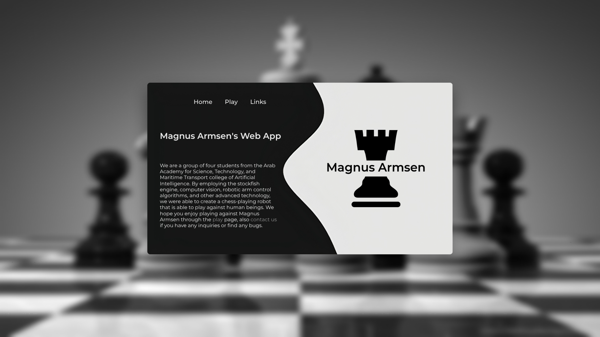
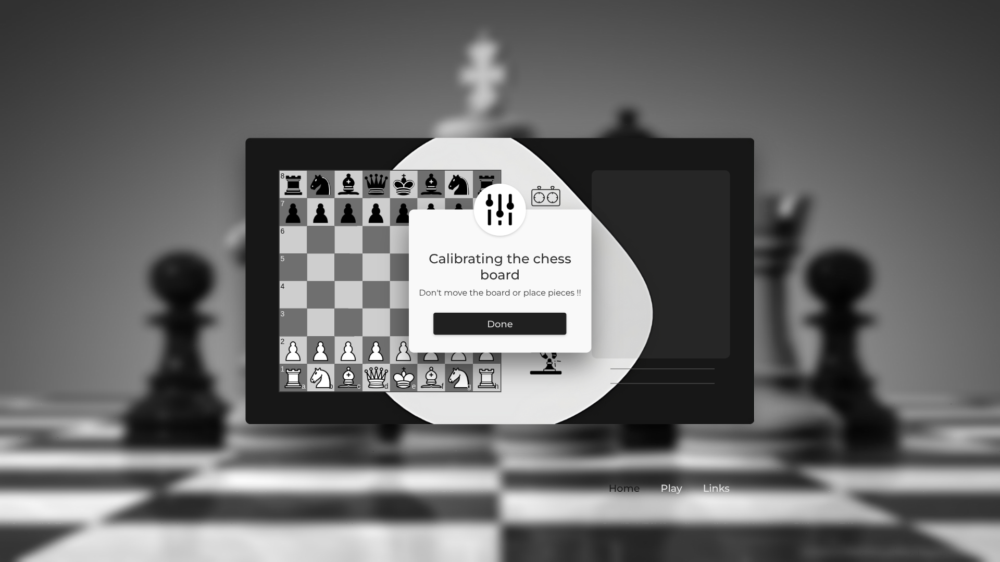
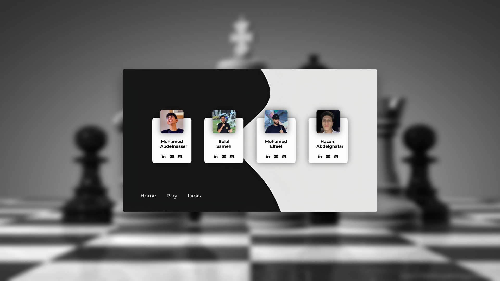

# Magnus Armsen, v1

A chess-playing robot arm, 3D-printed from scratch, driven by six hobby servos
from a Raspberry Pi, with a Flask web app as its interface.

Built March–May 2023 for **GN312, Embedded Systems & IoT** at AAST by
Hazem Abdelghafar, Mohamed Abdelnasser, Belal Sameh and Mohamed Elfeel, supervised by
Dr. Omar Shalash and Eng. Hossam Eldeen. Budget: 9,000 EGP.

<p align="center">
  
</p>

<p align="center">
  
</p>

## How it works

1. The camera photographs the empty board and a **homography** is computed,
   mapping the angled photo onto a flat square.
2. Before your move it takes a reference photo; after your move, another.
3. The two warped images are split into 64 tiles and compared. The four
   most-changed tiles are ranked.
4. The changed squares plus the board state give the move. 2 changed squares is
   a normal move, 3 is en passant, 4 is castling.
5. Stockfish replies, and the servo arm plays it.

Details: [vision](../docs/03-vision-c2m.md) · [kinematics](../docs/05-kinematics.md) · [engines](../docs/04-chess-engines.md)

## Layout

```
src/          the integrated application
  app.py        Flask server, game loop, browser protocol
  C2M.py        Chess board to Moves, the vision code
  ARM.py        servo control via PCA9685
  engine_path.py  cross-platform Stockfish lookup
web/          templates/ and static/ for the web app
prototypes/   per-subsystem code written before integration
  Arm/          servo experiments
  C2M/          vision experiments, with sample board images
  CEP/          Chess Engine Program, an early Stockfish wrapper
hardware/     STLs, Fritzing schematics, bill of materials
docs/         proposal, documentation, protocol notes
```

### About `prototypes/`

These are the original per-subsystem programs, kept as they were. They show the
development progression, and they are **not** all runnable.

`prototypes/CEP/main.py` does not even compile: the `elif len(newMoves) == 3:`
and `== 4:` branches at lines 60 and 62 have empty bodies. En passant and
castling were never implemented at the prototype stage. That logic was written
later, in the integrated `src/app.py` (lines 210 and 227). This is left exactly
as it was rather than quietly repaired.

## The browser ↔ Python protocol

There is no framework doing the state synchronisation. The team wrote it by
hand, and documented it in [`docs/protocol-notes.txt`](docs/protocol-notes.txt):
which variables cross in which direction, plus numeric error codes:
`Camera not found (12)`, `Couldn't calibrate (55)`, `Move Incorrect (100)`,
`Move Incorrect on site (101)`.

That file also contains the move-disambiguation rules, which are the cleverest
part of the whole project.

## Running it

```bash
pip install -r requirements.txt
python src/app.py          # http://127.0.0.1:9999
```

Stockfish must be installed, or `STOCKFISH_PATH` set. See
[docs/07-running.md](../docs/07-running.md).

**The web app, vision and engine run on any OS.** The arm does not: it needs a
Raspberry Pi with I²C enabled and a PCA9685 wired to six servos. `ARM.py` imports
and runs anywhere, refusing motion with an explanation when the hardware is
absent. `import ARM as arm` is commented out in `app.py` for exactly that reason.

**This arm path is untested**, because the hardware no longer exists. The six per-servo
`ZeroOffset` calibration constants are specific to one physical build.

## Screenshots

<p align="center">
  
  
  
</p>

## Known unfinished work

- **Voice control** was proposed and budgeted, with a speaker and microphone
  bought for it, framed around accessibility for players who know the game but cannot
  easily move pieces. Never implemented.
- **A match database** was listed as future work in the proposal. Never built.
- **Putting a wrongly-moved piece back.** The robot detects an illegal move and
  alerts; the proposal wanted it to correct the board itself.
